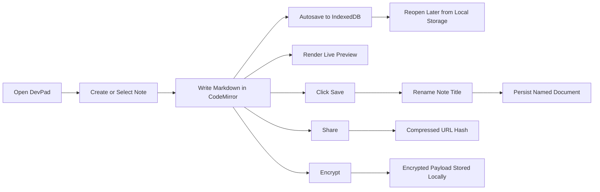
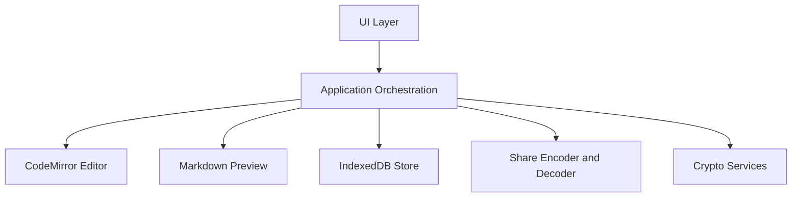
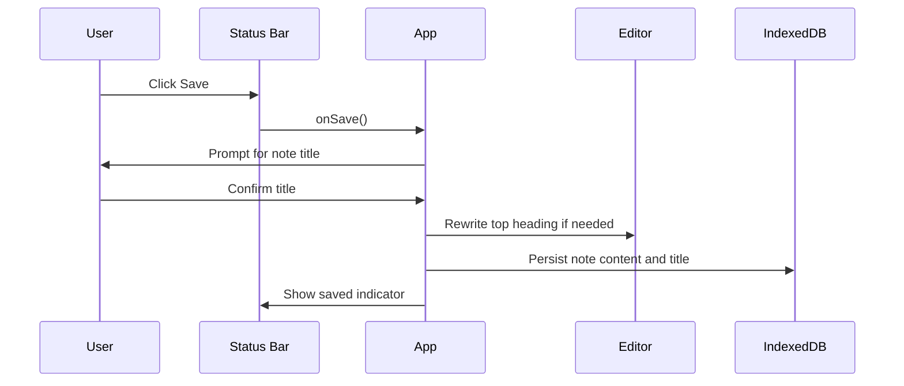
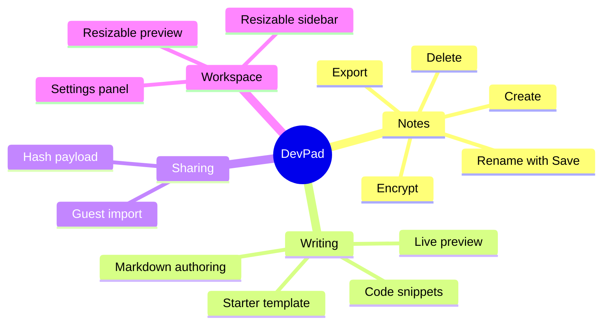

# DevPad

DevPad is a static, browser-local developer notepad built for fast Markdown drafting, code snippets, secure private notes, and shareable documents without any backend infrastructure.

## Overview

| Attribute | Value |
| --- | --- |
| Application type | Static web application |
| Runtime model | Browser-only |
| Persistence | IndexedDB via `idb` |
| Editor engine | CodeMirror 6 |
| Preview engine | `marked` with `highlight.js` |
| Share model | Compressed URL hash fragments |
| Encryption | AES-GCM with Web Crypto API |
| Deployment target | Static hosting or Vite preview |

## Core Capabilities

| Capability | Description |
| --- | --- |
| Local-first notes | Notes are created, updated, and retrieved entirely in the browser. |
| Automatic persistence | Content is autosaved on edit with IndexedDB as the source of truth. |
| Explicit save flow | A dedicated Save action lets users rename the note title and persist a clean document title intentionally. |
| Live preview | Markdown is rendered beside the editor with syntax-highlighted code blocks. |
| Share links | Notes can be serialized, compressed, and shared through URL hash payloads. |
| Optional encryption | Individual notes can be encrypted with a passphrase using AES-GCM. |
| Responsive workspace | Sidebar and preview panes can be resized and collapsed. |
| Static deployment | The application can be served directly as static assets without backend logic. |

## Product Workflow



## Architecture

### System Map



### Module Responsibilities

| Area | Path | Responsibility |
| --- | --- | --- |
| App bootstrap | `src/main.ts` | Loads styles and mounts the application. |
| App orchestration | `src/app.ts` | Coordinates notes, layout, preview rendering, saving, sharing, encryption, and settings. |
| Types | `src/types` | Shared application interfaces. |
| Constants | `src/constants` | Shared configuration values and default content. |
| Persistence | `src/store` | IndexedDB schema and note CRUD operations. |
| Encryption | `src/crypto` | Key derivation and AES-GCM encryption or decryption. |
| Editor | `src/editor` | CodeMirror setup, theme, and debounce behavior. |
| UI modules | `src/ui` | Sidebar, status bar, settings, share flow, and guest banner rendering. |
| Styles | `src/styles` | Tokens and feature-specific styling. |
| Tests | `tests` | Unit-level verification for storage, crypto, sharing, settings, notes, and status bar behavior. |

## Data Model

### Note Schema

| Field | Type | Purpose |
| --- | --- | --- |
| `id` | `string` | Stable note identifier. |
| `title` | `string` | Display name shown in the sidebar and export flow. |
| `content` | `string` | Markdown body, plaintext or encrypted payload. |
| `createdAt` | `number` | Creation timestamp in epoch milliseconds. |
| `updatedAt` | `number` | Last update timestamp in epoch milliseconds. |
| `encrypted` | `boolean` | Indicates whether the stored content is encrypted. |
| `tags` | `string[]` | Derived tags extracted from Markdown content. |

### Settings Schema

| Field | Type | Purpose |
| --- | --- | --- |
| `theme` | `'dark' \| 'light'` | UI appearance mode. |
| `fontSize` | `number` | Editor base font size. |
| `lineHeight` | `number` | Editor and preview readability tuning. |

## Save and Title Flow



## Local-First Persistence Strategy

| Operation | Behavior |
| --- | --- |
| Typing | Autosaves note content after debounce. |
| Saving | Prompts for a title, updates the document heading, and persists the renamed note explicitly. |
| Reloading | Restores notes from IndexedDB, sorted by most recent update. |
| Sharing | Encodes a transient payload into the URL hash without requiring a server. |
| Importing shared notes | Shared content can be imported into local storage as a new note. |
| Clearing data | Wipes both notes and settings stores from IndexedDB. |

## Security Model

| Concern | Approach |
| --- | --- |
| Server-side data exposure | None. The app has no backend and no remote database. |
| Note confidentiality | Optional per-note AES-GCM encryption with passphrase-derived keys. |
| Key storage | Raw encryption keys are never persisted. |
| Rendering safety | Preview content is sanitized before insertion into the DOM. |
| Share links | Payloads are compressed and stored in the URL fragment rather than transmitted to the server path or query string. |

## User Experience Map



## Directory Map

| Path | Description |
| --- | --- |
| `index.html` | Font loading and application mount point. |
| `vite.config.ts` | Vite build configuration. |
| `tsconfig.json` | Strict TypeScript configuration. |
| `src/` | Application source. |
| `tests/` | Automated test suite. |

## Development

### Prerequisites

| Tool | Recommended version |
| --- | --- |
| Node.js | 20 or later |
| npm | 10 or later |

### Run Locally

```bash
npm install
npm run dev
```

Open the local URL shown by Vite.

### Run Tests

```bash
npm test
```

### Build for Production

```bash
npm run build
```

### Preview the Production Build

```bash
npm run preview
```

## Testing Matrix

| Test File | Focus |
| --- | --- |
| `tests/crypto.test.ts` | Key derivation and AES-GCM encryption or decryption behavior. |
| `tests/share.test.ts` | Share payload encoding and decoding rules. |
| `tests/db.test.ts` | IndexedDB schema creation. |
| `tests/notes.test.ts` | Note CRUD and sorting behavior. |
| `tests/settings.test.ts` | Settings save interactions. |
| `tests/statusbar.test.ts` | Explicit save action rendering and callback wiring. |

## Operational Notes

| Topic | Detail |
| --- | --- |
| Backend services | None required. |
| Offline support | Browser-local data survives refreshes through IndexedDB. |
| Multi-device sync | Not included. Shared links are intended for transfer, not synchronization. |
| Collaboration | Not included. Each browser instance owns its own local store. |
| Search | Not currently implemented. |

## Quality Standards Applied

| Standard | Result |
| --- | --- |
| Strict typing | TypeScript strict mode across the project. |
| Local-first architecture | No application backend. |
| Production build validation | Verified with Vite production build. |
| Automated testing | Covered by Vitest for core behaviors. |
| Workspace hygiene | Build artifacts and local logs are ignored through `.gitignore`. |

## Future Extension Ideas

| Direction | Value |
| --- | --- |
| Full-text search | Faster retrieval across large note collections. |
| Import and export bundles | Easier migration between browsers or devices. |
| Keyboard shortcut help | Faster onboarding for power users. |
| Rich export targets | HTML or PDF output for publishing workflows. |

## License

This project is licensed under the MIT License. See [LICENSE](./LICENSE) for the full text.
